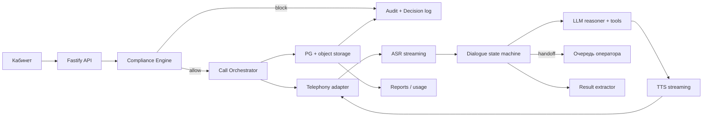

# Карта технологических решений ИИ-коллектора

Дата: 17.08.2026  
Статус: аналитический контур v1  
Связанные документы: [PRD](../product/prd-draft.md), [открытые вопросы PRD](../product/prd-open-questions.md), [roadmap](../../ROADMAP_B2B_SAAS.md), [backend stack](../decisions/0001-backend-stack.md), [SSO](../decisions/0002-sso-approach.md), [live voice](../decisions/0003-live-voice-provider.md), [speech/LLM](../decisions/0004-speech-llm-stack.md), [BYOK](../decisions/0005-byok-speech-llm.md), [rulebook v1](../compliance/rulebook-v1.md), [on-prem](../enterprise/on-prem-assessment.md)

Документ отвечает на вопрос: **какие технологии нужны на каждом этапе продукта, какие из них ядро, какие обеспечивающие, и как они связаны с ФЗ и текущим контуром репозитория.**

Это не юридическое заключение и не выбор конкретного вендора «навсегда». Нормы ниже взяты из уже зафиксированных продуктовых источников (`index.html`, PRD, roadmap, PRODUCT_LANGUAGE). Правила, которые ещё не подтверждены юристом, помечены как `legal-confirm`.

## 1. Как читать карту

### 1.1. Этапы продукта

Совпадают с `ROADMAP_B2B_SAAS.md`:

| Этап | Цель | Что считается успехом |
|---|---|---|
| 0. Discovery | Можно ли легально и технически звонить | Legal-safe call-flow, провайдер, baseline, hard gates |
| 1. MVP Lab | Рабочее ядро без масштаба | Кампания → проверка → sandbox-звонок → журнал → отчёт из событий |
| 2. Controlled Pilot | Ограниченный live-трафик | 0 подтверждённых нарушений, QA, автопауза, сверка CDR |
| 3. Production SaaS v1 | Несколько платящих клиентов | Tenant isolation, RBAC/SSO, биллинг, onboarding без переписывания кода |
| 4. Scale / enterprise | Банки, on-prem, резервирование | Multi-provider, HA/DR, локальный speech/LLM, ИБ-пакет |

### 1.2. Три плоскости технологий

| Плоскость | Смысл | Примеры |
|---|---|---|
| **Core** | Без этого нельзя безопасно выполнить первый контакт | Compliance engine, телефония, ASR/TTS, LLM+state machine, handoff, audit/evidence |
| **Platform** | Нужно, чтобы ядро работало как продукт | PostgreSQL, backend API, UI, очереди, object storage, хостинг, секреты |
| **Adjacent** | Нужно для продажи, масштаба и enterprise, не для первого пилота | SSO/SAML, биллинг, SFTP, SIEM, on-prem, второй провайдер, отчёт ФССП |

Правило приоритета из PRD сохраняется: **сначала допуск к звонку, затем сам звонок, затем перевод человеку, затем история и отчёт.**

### 1.3. Статусы решений в этом документе

- `выбрано` — уже есть ADR или рабочий код.
- `рекомендовано` — лучший следующий выбор под продукт и ФЗ, ещё не зафиксирован отдельным ADR.
- `legal-confirm` — нельзя внедрять как «факт закона» и не пускать live, пока нет memo юриста.
- `позже` — не нужно до указанного этапа.

Направления пилота, зафиксированные 17.08.2026: телефония — [ADR 0003](../decisions/0003-live-voice-provider.md) (Exolve, запасной Mango); речь и LLM — [ADR 0004](../decisions/0004-speech-llm-stack.md) (SpeechKit + YandexGPT, запасной GigaChat). Коммерческий договор и legal memo всё ещё впереди.

## 2. Текущее состояние (as-is)

На 21.08.2026 проект находится **между поздним MVP Lab и подготовкой Controlled Pilot**. Закрыта волна клиентского кабинета CJ; идёт выравнивание SoT (auth cookie, OpenAPI cabinet subset, voice resolver, async outbox).

Уже есть:

- Backend: Node.js 20 + TypeScript + Fastify + Prisma + PostgreSQL 16 + Vitest.
- Домен расширен: SuppressionEntry, FrequencyLedger (+ durable attempts), ProviderCredential, PromptVersion, WebhookInboxEvent, OutboxEvent и др.
- Compliance pilot rules: call-window + праздники, consent, debt status, frequency 1/2/8, suppression, legalBasis.
- Телефония: sandbox + скелеты **Exolve (primary)** и Mango (backup) без HTTP live.
- Речь/диалог: ASR/TTS/LLM adapters (fake + Yandex/GigaChat skeleton), BYOK store, state machine, extractor, golden set.
- Platform: docker-compose (PG+Redis), BullMQ skeleton, transactional outbox (в работе), fake object store, structured logger.
- UI: корневой `prototype.html` — рабочий кабинет; `public/` — GitHub Pages publish root (копии для сайта).
- Auth: **cookie session SoT**; header identity только при `ALLOW_HEADER_IDENTITY` вне production (ADR 0002).

Критические пробелы ядра:

- нет HTTP live Exolve/SpeechKit (blocked на DPA/legal);
- нет полноценного live call orchestrator end-to-end (`POST .../calls/live` → 501);
- third-party disclosure guard и AI disclosure в runtime не на live path;
- CDR reconciliation, payment outcome, complaint/holdout для пилота;
- клиентский кабинет не полностью API-backed; OpenAPI v1 = cabinet subset, не полный surface;
- outbox consumer ещё не закрыт на все mutations (`T-258`).

## 2.1. Async и UI SoT (кратко)

- Async side effects: Outbox — канон; jobs — skeleton. См. [async SoT](./2026-08-21-async-sot.md).
- Pages: только `public/`. Кабинет в разработке: корневой `prototype.html` (синхронизировать в `public/prototype.html` при publish-relevant правках).
- Adjacent freeze: support grants, tenant billing settings API, GigaChat stub — не расширять без задачи этапа Scale/SaaS.

## 3. Нормативный контур → технические контроли

Любая выбранная технология должна помогать **доказать** решение постфактум. Если компонент не пишет evidence или не может быть остановлен compliance engine, он не годится в core.

### 3.1. Сводка законов, которые продукт уже учитывает

| Источник | Что требует продукт | Технический контроль | Когда обязательно | Статус |
|---|---|---|---|---|
| ФЗ‑230 | Окно звонка по месту жительства/пребывания: 08:00–22:00 рабочие, 09:00–20:00 выходные и праздники | Timezone + calendar + `CallWindowComplianceRule` | MVP Lab (упрощённо), Pilot (полное) | частично в коде; праздники/выходные — `legal-confirm` на полноту |
| ФЗ‑230 | Лимит взаимодействий 1 / 2 / 8 (сутки / неделя / месяц) на кредитора и самостоятельное обязательство, не на кампанию | Frequency ledger на уровне tenant+obligation | Pilot | durable в коде (`FrequencyLedger` + attempts); определение «состоявшегося контакта» и live enforcement — `legal-confirm` |
| ФЗ‑230 | Представиться как автоматизированный интеллектуальный агент: условное имя, ID, кредитор | Script/prompt gate + версия сценария в audit | MVP Lab (текст), Pilot (runtime enforcement) | есть в прототипе речи; нет runtime-проверки |
| ФЗ‑230 | Продолжение взаимодействия с физическим лицом | Handoff queue, SIP transfer, SLA, автопауза при перегрузе | Pilot | модель `handoff` есть; live transfer нет |
| ФЗ‑230 | Не раскрывать долг третьему лицу до верификации | Identity gate до disclosure; запрещённые tools у LLM | Pilot | нет |
| ФЗ‑230 | Suppression: отказ, банкротство, спор, запрет контакта, представитель, льготный период, недееспособность | `debtStatus` / `consentStatus` / suppression list | MVP Lab (часть), Pilot (полный список) | `closed/disputed/bankruptcy/contact_forbidden/revoked` есть |
| ФЗ‑230 ст. 17/17.1 | Хранение материалов взаимодействия ≥ 1,5 года | Object storage + retention job + WORM/audit | Pilot | `legal-confirm` применимость к роли платформы |
| 152‑ФЗ | Оператор ПДн = клиент (МФО/банк); платформа = обработчик по поручению | DPA, цели, состав полей, уничтожение, субподрядчики | Discovery/Pilot | договор, не код |
| 152‑ФЗ | Первичная запись/хранение ПДн граждан РФ — в РФ | Хостинг, БД, object storage, ASR/TTS/LLM в РФ или on-prem | Pilot | `рекомендовано` |
| 152‑ФЗ | Минимизация: в модель уходит только поле текущего шага | Prompt/tool firewall; сумма долга не в ASR/LLM до верификации | Pilot | нет |
| 152‑ФЗ | Голос ≠ биометрия автоматически, но voice biometrics — отдельный режим | Запрет speaker identification / voiceprint в v1 | все этапы | `рекомендовано` запретить |
| 126‑ФЗ, ст. 44.1‑1 | Согласие на массовые/автоматические вызовы; учёт отказа абонента у оператора связи | Поле основания вызова + sync operator opt-out | Pilot | **коллизия с ФЗ‑230**, только `legal-confirm` |
| 126‑ФЗ + ПП №1300 | Маркировка бизнес-звонков / отображение инициатора | Контракт с оператором, CNAM/маркировка, probe перед launch | Pilot | в UI как требование, в коде нет |
| 20‑ФЗ от 11.02.2026 | Отчёт кредитных и МФО о деятельности по возврату | Полный event ledger, проектировать выгрузку | SaaS / по форме | не обещать готовый отчёт ФССП, пока нет формы |
| ФЗ‑127 | Банкротство как запрет контакта | `debtStatus=bankruptcy` + актуальная синхронизация статуса | MVP Lab | правило есть; актуальность базы — процесс |
| ФЗ‑353 / регулирование ЦБ для МФО | Клиент несёт отраслевые обязанности | Экспорт evidence, не подмена compliance клиента | Pilot+ | adjacent |
| ПП 1119 + приказ ФСТЭК №21 | Меры защиты ПДн (УЗ) | Шифрование, журналы, СЗИ, аттестация контура | Scale / банк | позже |
| ФЗ‑187 КИИ | Только если клиент признан субъектом КИИ | Выделенный контур | Scale | позже, не для МФО-пилота |

Коллизия, которую продукт **не имеет права закрыть сам**: основание автоматических вызовов по закону о связи vs допустимое взыскание по ФЗ‑230. До legal sign-off live traffic не запускается.

### 3.2. Что из этого уже нельзя отдавать «на усмотрение LLM»

LLM не принимает юридическое решение. Он работает только после `allow` compliance engine и только внутри state machine.

Fail-closed для:

- нет решения compliance;
- нет записи/транскрипта, если политика этапа требует evidence;
- нет доступного handoff при запросе человека;
- нет маркировки на live;
- потеря audit/logging.

## 4. Целевая схема ядра

Инвариант: **Compliance Engine стоит до оркестратора и имеет право физически не создать `CallAttempt`.** Это уже соблюдено для sandbox-звонка.

## 5. Каталог решений: core

Для каждого блока: зачем, что выбрать по этапам, ограничения ФЗ, зависимость.

### 5.1. Compliance engine и rulebook

**Зачем:** единственный источник истины «можно ли совершить это действие сейчас».

| Этап | Решение | Статус |
|---|---|---|
| 0 | Legal-safe rulebook v1 отдельным документом; не кодировать до подтверждения спорных норм | `legal-confirm` |
| 1 | Rule interface + engine + decision log. Сейчас: время, consent, debt status | `выбрано` |
| 2 | Frequency ledger, праздники, suppression, identity/disclosure policy, handoff policy, версия правил на каждый decision | `рекомендовано` |
| 3 | Per-tenant параметры в разрешённых пределах; системные правила нельзя выключить в UI | `рекомендовано` |
| 4 | Policy DSL, four-eyes на публикацию правил, экспорт для регулятора | позже |

Реализация: TypeScript-модули в `src/compliance/*`, версия `ruleVersion` в `ComplianceDecision`. Не выносить правила в промпт.

Нельзя: переключатель «выключить compliance», force-call, LLM как судья допуска.

### 5.2. Телефония / voice provider

**Зачем:** исходящий вызов, статусы, запись, перевод, маркировка, CDR.

| Этап | Решение | Статус |
|---|---|---|
| 0 | Выбрать одного оператора и проверить маркировку, запись, SIP/API, договор основания вызова | Discovery |
| 1 | `VoiceProviderAdapter` + sandbox | `выбрано` |
| 2 | Один боевой провайдер через тот же adapter | `рекомендовано` |
| 3 | Provider resolver per tenant, healthcheck, автопауза `provider_sla_failed` | задел есть |
| 4 | Второй провайдер и failover | паттерн описан, кода нет |

Кандидаты, уже названные продуктом:

1. **МТС Exolve** — целевой live-провайдер пилота по [ADR 0003](../decisions/0003-live-voice-provider.md); Voice API/SIP, не пакет Robots.
2. **Mango Office / Mangotelecom** — запасной путь того же ADR и партнёр PRD.
3. **Delfin** — партнёр по интеграциям, не telephony core.
4. **Собственная АТС клиента** — только adjacent/enterprise.

Свой SIP-стек не строим — это зафиксировано в ADR 0003.

Сравнение каналов (CPaaS, BYO SIP, OpenAI, робот вендора) для обсуждения: [telephony-options.html](./2026-08-17-telephony-options.html). Пакет вопросов PRD/цены: [план 17.08.2026](../superpowers/plans/2026-08-17-pilot-telephony-prd-commercial-decisions.md).

Обязательные сигналы адаптера: start/status/hangup, recording available, transfer, AMD/voicemail, CDR fields для сверки usage.

ФЗ-связь: 126‑ФЗ / маркировка / согласие на автовызовы. Без маркировки live launch блокируется readiness.

### 5.3. Call orchestrator

**Зачем:** жизненный цикл попытки: queued → ringing → answered → dialog → completed/handoff/fail.

| Этап | Решение | Статус |
|---|---|---|
| 1 | Синхронный sandbox start в API | `выбрано` как заглушка |
| 2 | Фоновые воркеры, concurrency per tenant/campaign, retry policy, AMD, stop on auto-pause | `рекомендовано` |
| 3 | BullMQ + Redis, как уже намечено в ADR | `рекомендовано` |
| 4 | Горизонтальные воркеры, backpressure, multi-region telephony | позже |

Без оркестратора нельзя честно соблюдать лимиты линий и frequency ledger.

### 5.4. ASR (распознавание)

**Зачем:** русский streaming, цифры/даты, шум, barge-in, confidence → fallback.

| Этап | Решение | Статус |
|---|---|---|
| 1 | Нет боевого ASR; тестовый диалог в UI | as-is |
| 2 | Streaming ASR в РФ, word-level timestamps для extractor, confidence | `рекомендовано` |
| 3 | Adapter ASR, смена вендора без смены оркестратора | `рекомендовано` |
| 4 | On-prem ASR (банк) | later |

Кандидаты с локализацией в РФ:

- Yandex SpeechKit;
- Sber Salute Speech / GigaAM;
- T-Bank VoiceKit;
- self-hosted (GigaAM / Whisper-like) только если latency и WER подтверждены на collection corpus.

Не рекомендуется для live ПДн: зарубежный cloud ASR (Google, OpenAI Whisper API, Deepgram) — трансграничная передача 152‑ФЗ.

Метрика допуска: WER на доменном корпусе, не «кажется, что понимает». Порог низкой уверенности → human handoff. Численный порог — открытый вопрос PRD.

### 5.5. TTS (синтез)

**Зачем:** естественная русская речь, стабильный голос кампании, низкий first-byte latency, возможность прерывания.

| Этап | Решение | Статус |
|---|---|---|
| 1 | Заготовленные фразы в прототипе | as-is |
| 2 | Streaming TTS того же РФ-контура, что ASR, либо отдельный голос с договором обработки ПДн | `рекомендовано` |
| 3 | Версия голоса в `ScriptVersion`; запрет смены голоса на running-кампании без новой версии | `рекомендовано` |
| 4 | On-prem TTS | later |

Требование продукта: голос настраивается в UI, но **юридически значимые фразы** (раскрытие агента, кредитор, ID) не должны быть свободно переписаны так, чтобы обойти disclosure.

### 5.6. LLM, промпты, state machine

**Зачем:** вести диалог внутри разрешённых шагов, извлекать PTP, не галлюцинировать долг, не раскрывать лишнее.

Архитектура диалога:

1. Жёсткая state machine (идентификация → disclosure → цель звонка → PTP/отказ/спор → подтверждение → завершение/handoff).
2. LLM как reasoner внутри шага, не как маршрутизатор политики.
3. Allowlisted tools: `set_outcome`, `request_handoff`, `schedule_callback`, `end_call`. Нет tool «сказать сумму», пока identity gate не пройден.
4. Prompt/version registry: system prompt, policy snippet, script version, model id, temperature, дата публикации.
5. Golden set + red-team: третье лицо, угрозы, prompt injection, запрос оператора, спор долга, шум.

| Этап | Решение | Статус |
|---|---|---|
| 0 | Зафиксировать call-flow с юристом | Discovery |
| 1 | `ScriptVersion.content` как текст сценария | частично |
| 2 | State machine runtime + РФ LLM API + prompt registry | `рекомендовано` |
| 3 | A/B только на не-юридических формулировках; юридические фразы locked | `рекомендовано` |
| 4 | On-prem LLM (GigaChat local / Qwen/Llama в контуре клиента) | later |

Кандидаты LLM в РФ (направление [ADR 0004](../decisions/0004-speech-llm-stack.md)):

- YandexGPT (Yandex Cloud) — целевой для пилота МФО;
- GigaChat — запасной и on-prem путь для банков;
- локальная open-weight модель в VPC клиента — этап Scale.

Не рекомендуется как production-core для ПДн должника: OpenAI, Anthropic, Google — пока нет подтверждённого правового основания и локализации.

Промпты хранить не в git «как единственная правда», а в registry с audit. В git — шаблоны и golden tests.

### 5.7. Identity gate и third-party guard

**Зачем:** до верификации личности не называть сумму и основание долга.

Технически: отдельный шаг оркестратора, не «промпт попросил вежливо». Результат шага пишется в timeline звонка.

Обязателен с Controlled Pilot. В MVP Lab достаточно запрета в сценарии и QA-разметки.

### 5.8. Human handoff

**Зачем:** ФЗ‑230 — возможность продолжить с человеком; продуктный fallback при низкой уверенности.

Нужно:

- SIP/PSTN transfer на номер/очередь клиента;
- причина, контекст, запись/транскрипт к моменту перевода;
- очередь `review-items` уже контрактована;
- автопауза `handoff_overloaded`.

Без живой очереди оператора клиента **нельзя** обещать legal-safe live.

### 5.9. Evidence: запись, транскрипт, decision trail

PRD v1 сознательно **не** включает прослушивание аудио в UI, но запись как backend-evidence для пилота нужна.

| Артефакт | Где хранить | Retention | Кто видит в UI |
|---|---|---|---|
| Audio | Object storage РФ, encryption at rest | `legal-confirm`, ориентир ≥ 18 мес. | Pilot: нет / SaaS: по роли |
| Transcript | PG или object + индекс | как audio | v1: да |
| ComplianceDecision | PostgreSQL | не короче кампании + срок спора | да |
| AuditLog | PostgreSQL, append-only | отдельно, дольше операционных логов | по роли |
| Prompt/policy version | registry | вместе с decision | compliance/QA |
| CDR | raw + normalized | сверка с usage | integration_admin |

Автопауза уже предусматривает `recording_failed` как stop-condition.

### 5.10. Result extractor

Структурированный итог: PTP amount/date, причина, dispute, handoff reason, next action. Не свободный текст LLM в отчёт.

Рекомендация: schema-constrained extraction (JSON schema / tool call) + QA confirmation. Метрика — accuracy на golden set, не «LLM уверен».

## 6. Каталог решений: platform (не core, но обязательны)

### 6.1. Backend

`выбрано`: Node.js 20, Fastify, TypeScript strict, Zod, Prisma.

Дальше:

| Этап | Добавить |
|---|---|
| 1 | уже API кампаний, импорта, compliance, sandbox calls, reports, audit, readiness |
| 2 | job workers, webhook receiver от телефонии, идемпотентность событий |
| 3 | rate limits (задел есть), идемпотентность интеграций, OpenAPI |
| 4 | split voice-runtime vs control-plane при необходимости |

Не менять стек без нового ADR.

### 6.2. База данных

`выбрано`: PostgreSQL 16 как system of record для домена, решений, аудита, usage.

Рекомендации:

- row-level tenant filter в repository (уже требование ADR);
- позже: `tenantId` во всех индексах, партиционирование `CallAttempt`/`AuditLog`/`UsageEvent` по времени;
- не использовать отдельную «AI-базу» для ПДн;
- Redis — только очереди/кэш/idempotency, не источник истины.

Для frequency ledger: отдельная таблица счётчиков по `(tenantId, creditorKey, obligationId, bucket)` с идемпотентными инкрементами. Это core-данные, хотя технически это «просто таблица».

### 6.3. Object storage и файлы

Нужно с этапа 2: CSV/XLSX исходники, audio, transcripts, export packs.

`рекомендовано`: S3-совместимое хранилище в РФ (Yandex Object Storage, Selectel S3, Cloud.ru). SSE, bucket isolation per env, lifecycle/retention, запрет public ACL.

### 6.4. Очереди и realtime

ADR: позже BullMQ + Redis; MVP может in-process.

С live-звонками in-process недостаточно: нужен worker, который переживает рестарт API, знает pause/stop и не стартует звонок после auto-pause.

Для UI мониторинга: SSE или polling. WebSocket не обязателен в v1.

### 6.5. Frontend

As-is: `prototype.html` как операторский кабинет.

| Этап | Решение | Статус |
|---|---|---|
| 1 | Довести HTML-кабинет до API-backed happy path | `рекомендовано` не переписывать сейчас |
| 2 | Тот же кабинет + review/QA/live статусы | |
| 3 | SPA (Vite + React + TypeScript) на тех же API, если HTML станет узким местом | `рекомендовано`, отдельный ADR |
| 4 | White-label, SSO redirect, dense enterprise tables | later |

`.env.example` уже содержит `CORS_ORIGINS=http://localhost:5173` — это намёк на будущий Vite, не текущий факт.

Не делать frontend источником compliance.

### 6.6. Хостинг и контур

| Этап | Где крутится | Статус |
|---|---|---|
| 0–1 | Локально: Node + PostgreSQL. Нужен `docker-compose` (сейчас отсутствует) | пробел platform |
| 2 | Один регион РФ: Yandex Cloud / Selectel / Cloud.ru. App + PG + Redis + S3. Нет зарубежного control plane для ПДн | `рекомендовано` |
| 3 | Kubernetes или managed containers, staging/prod, backups, TLS, WAF | `рекомендовано` |
| 4 | Private cloud / on-prem по `docs/enterprise/on-prem-assessment.md`; гибрид: телефония у оператора, speech/LLM у клиента | later |

Минимальный контур пилота:

- VM или контейнеры в РФ;
- managed PostgreSQL в РФ;
- object storage в РФ;
- секреты в Lockbox/Vault, не в git;
- исходящий доступ только к telephony и speech/LLM adapters;
- запрет отправки ПДн в иностранные LLM.

### 6.7. Секреты, сеть, безопасность

Уже: секреты не в доменной модели телефонии; RBAC middleware; rate limit.

Дальше по этапам:

| Контроль | Этап |
|---|---|
| Tenant BYOK для ASR/TTS/LLM: envelope AES-GCM в PG, allowlist РФ-провайдеров ([ADR 0005](../decisions/0005-byok-speech-llm.md)) | 2 |
| Env/secret manager, ротация ключей провайдеров; вынести ciphertext в Lockbox/Vault | 2 |
| TLS everywhere, audit access to recordings | 2 |
| MFA для пользователей кабинета | 3 (до этого — на стороне клиента) |
| OIDC (`0002-sso-approach.md`) | после pilot readiness |
| SAML per-tenant IdP | 4 |
| Encryption at rest (PG + S3), KMS | 3 |
| SIEM export, DLP, pentest package | 4 |
| Voice biometrics | запрет в v1 |

### 6.8. Наблюдаемость

Обязательные метрики из roadmap: answer rate, drop, transfer fail, ASR/TTS/LLM errors, queue lag, auto-pause count, CDR mismatch.

`рекомендовано`: OpenTelemetry + Prometheus/Grafana + structured logs с `tenantId/campaignId/callAttemptId`. Алерты на stop-conditions, не только на 5xx.

### 6.9. CI/тесты

`выбрано`: Vitest. Skills bootstrap проверяется в `npm test` / `typecheck`.

Для ядра диалога с этапа 2: golden dialogues как тесты, не ручной «потыкали». Без этого LLM нельзя выпускать в live.

## 7. Adjacent: не ядро продукта, но нужно по этапам

| Блок | Этап входа | Решение |
|---|---|---|
| Импорт CSV/Excel | 1, уже есть CSV | Excel parser — P1 продукта; профили маппинга — SaaS |
| Ручное добавление контакта | открытый вопрос PRD | не блокирует стек |
| API/SFTP/webhooks | 3, контракт v0 есть | идемпотентность `sourceSystem+eventId` |
| CRM/АБС/collection sync | 3+ | не в v1 PRD |
| Billing / usage ledger | ledger v0 есть; инвойсы — 3 | единица: connected minute + successful dialog + storage |
| SSO OIDC/SAML | 3/4 | ADR 0002 |
| Отчёт ФССП/Минюста | после формы | только event ledger сейчас |
| BI | 4 | не подменять отчёт из реальных событий |
| Email/SMS после звонка | `legal-confirm` как отдельное взаимодействие по ФЗ‑230 | не включать в v1 |
| Второй telecom provider | 4 | adapter уже готов к расширению |
| On-prem speech/LLM | 4 / банк | отдельный deploy flavor |

## 8. Карта «этап × технология»

Обозначения: **C** core, **P** platform, **A** adjacent.  
`есть` / `нужно` / `запрещено до legal` / `не надо`.

### Этап 0. Discovery

| Блок | Плоскость | Решение | Действие |
|---|---|---|---|
| Rulebook ФЗ‑230/152/126 | C | документ + sign-off юриста | нужно |
| Определение контакта для 1/2/8 | C | legal-confirm | запрещено кодировать наугад |
| Основание автовызовов | C | коллизия 44.1‑1 vs 230 | запрещено live |
| Выбор CPaaS и маркировки | C | Exolve или Mango + договор | нужно |
| Обезличенный корпус звонков | C | для WER/golden set | нужно |
| Хостинг РФ | P | выбрать облако пилота | нужно |
| UI/backend | P | текущий репозиторий достаточен | есть |
| Биллинг/SSO | A | не надо | не надо |

### Этап 1. MVP Lab — текущий фокус репозитория

| Блок | Плоскость | Стек | Состояние |
|---|---|---|---|
| Backend API | P | Fastify/TS | есть |
| PostgreSQL + Prisma | P | PG 16 | есть |
| Tenant/RBAC/audit | P/C | middleware + AuditLog | есть v0 |
| Импорт CSV | C-data | parser/validator | есть; Excel — нужно по PRD |
| Compliance v1 | C | 3 правила | есть; мало для пилота |
| Sandbox telephony | C | adapter | есть |
| Script versions | C | API | есть, без runtime SM |
| Reports from events | P | campaign report | есть |
| UI кабинет | P | prototype.html | частично API |
| Docker Compose | P | PG+app | нужно |
| ASR/TTS/LLM live | C | — | не надо в lab, кроме контрактов |
| Redis/BullMQ | P | — | можно отложить, если нет очереди обзвона |
| Object storage | P | — | можно файлы локально, но контракт URL уже есть |

Exit MVP Lab: пользователь создаёт кампанию, грузит базу, проходит readiness, делает тестовый звонок, видит decision + результат. Боевой ASR не обязателен, если тестовый контур честно помечен как sandbox.

### Этап 2. Controlled Pilot

Без этого набора live не запускать.

| Блок | Плоскость | Минимальное решение |
|---|---|---|
| Live telephony + маркировка | C | один провайдер, probe в readiness |
| Recording + transcript pipeline | C | S3 РФ + ASR; автопауза если нет записи |
| Streaming ASR/TTS | C | РФ-вендор, barge-in, confidence |
| LLM + state machine + prompt registry | C | РФ LLM, locked disclosure |
| Identity / third-party guard | C | шаг до суммы долга |
| Frequency ledger + полный call-window | C | 1/2/8, праздники, timezone должника |
| Handoff live | C | перевод на очередь клиента + SLA |
| Workers | P | Redis + BullMQ |
| Observability + daily QA | P/C | выборка звонков, review queue |
| Holdout/control | A | разметка в кампании, не отдельный стек |
| Legal DPA + основание вызова | A | договор | 

### Этап 3. Production SaaS v1

| Блок | Плоскость | Минимальное решение |
|---|---|---|
| Multi-tenant prod | P | изоляция, квоты, backup |
| OIDC | P | ADR 0002 |
| Billing ledger | A | сверка CDR ↔ usage |
| API/webhooks для статусов долга | A | чтобы база не устаревала |
| Staging/prod + secret rotation | P | |
| Frontend SPA при необходимости | P | |
| Retention/deletion jobs | C/P | 152‑ФЗ уничтожение |
| Runbooks | P | автопауза, провайдер down, leak |

### Этап 4. Scale / enterprise

| Блок | Плоскость | Минимальное решение |
|---|---|---|
| Второй telephony provider | C | failover |
| On-prem/private cloud | P | чеклист уже есть |
| Local ASR/TTS/LLM | C | банк/ИБ |
| HA/DR, RPO/RTO drills | P | |
| SAML, SIEM, pentest, УЗ | A | |
| SFTP batch | A | |
| ФССП export, если форма появится | A | |
| Marketplace сценариев | A | только с four-eyes и rule lock |

## 9. Рекомендуемый состав пилота (один конкретный стек)

Это рекомендация для Controlled Pilot МФО, не для банка.

| Слой | Выбор | Почему |
|---|---|---|
| Control plane | текущий Fastify + Prisma + PostgreSQL | уже выбран, менять рано |
| Jobs | Redis + BullMQ | совпадает с ADR, нужен для обзвона |
| Files/audio | Yandex Object Storage или Selectel S3 | РФ, S3 API |
| Hosting | Yandex Cloud или Selectel, регион ru-central | 152‑ФЗ |
| Secrets | Yandex Lockbox / HashiCorp Vault | не в PG |
| Telephony | МТС Exolve Voice API; запасной Mango | [ADR 0003](../decisions/0003-live-voice-provider.md) |
| ASR+TTS | Yandex SpeechKit | [ADR 0004](../decisions/0004-speech-llm-stack.md) |
| LLM | YandexGPT; запасной GigaChat | тот же ADR 0004 |
| Ключи речи/модели | Platform env или tenant BYOK | [ADR 0005](../decisions/0005-byok-speech-llm.md) |
| Dialogue | своя state machine + versioned prompts | нельзя отдать вендорскому «свободному боту» |
| Frontend | prototype.html до конца пилота | скорость, PRD против перегруженного UI |
| Auth | header mock в lab; для пилота клиента — shared accounts + audit, OIDC сразу если ИБ требует | ADR 0002 |
| Observability | structured logs + Grafana | дешевле полного APM |
| Tests | Vitest + golden dialogues | safety gate |

Что сознательно **не** берём в пилот: Kubernetes-обязательность, Kafka, отдельный feature store, RAG по договорам, voice biometrics, зарубежные LLM, свой Asterisk, прослушивание аудио в UI.

## 10. Поток данных и ПДн

Минимизация:

1. Импорт: ФИО/телефон/сумма/статус долга/согласие/таймзона — в PostgreSQL, tenant-scoped.
2. Допуск: compliance читает статус и счётчики, не отправляет ПДн во внешний LLM.
3. Набор: телефония получает номер и call-id, не полный долг.
4. После ответа: ASR получает аудио. В идеале — внутри РФ и по поручению.
5. Identity gate: LLM видит только реплики и скрипт верификации, **без суммы**.
6. После allow disclosure: сумма и дата как tool-input из нашей БД, не из «памяти модели».
7. Хранение: audio/transcript с retention; доступ по роли; экспорт для спора.
8. Уничтожение: job по политике, с audit «что удалено».

Субподрядчики (telephony, ASR, TTS, LLM, cloud) должны быть перечислены в поручении на обработку. Смена вендора — юридическое событие, не только деплой.

## 11. COGS, которые надо мерить отдельно

Даже если робот-платформа продаёт «всё включено», внутренний учёт должен разделять:

- телефония / минута соединения;
- ASR;
- TTS;
- LLM (на диалог и/или на минуту);
- хранение audio/transcript;
- handoff (стоимость оператора клиента — не наш COGS, но метрика нагрузки);
- наша инфраструктура.

Иначе нельзя проверить contribution margin пилота. Калькулятор в `index.html` это уже показывает; биллинг v0 закладывает connected minute + successful dialog + storage.

## 12. Разрывы и следующие технические решения

Нужны отдельные шаги, когда дойдём до стенда и договора:

1. Коммерция и DPA live-провайдера по [ADR 0003](../decisions/0003-live-voice-provider.md) (Exolve, backup Mango).
2. Стенд SpeechKit + YandexGPT и замер WER/latency по [ADR 0004](../decisions/0004-speech-llm-stack.md).
3. Object storage и retention после legal memo по сроку хранения.
4. Redis/BullMQ vs иная очередь — когда появится live orchestrator.
5. Остаёмся на HTML или уходим в React — не раньше, чем API-backed поток стабилен.
6. Legal memo по [rulebook v1](../compliance/rulebook-v1.md) — блокер кодирования 1/2/8 как юридического факта, праздников, согласия на автовызов, срока хранения и live mode.

Не нужно решать сейчас: Kafka, on-prem LLM как обязательный контур МФО, SAML, второй провайдер, отчёт ФССП.

## 13. Связь с PRD

PRD фиксирует **что** должен уметь пользователь и **какие границы релиза**. Этот документ фиксирует **чем** это реализуется по этапам.

Следствия для продукта:

- v1 «без прослушивания аудио» совместим с обязательным хранением записи на backend;
- v1 «без сложных интеграций» совместим с ручным CSV и обязательным ручным refresh статусов долга — это compliance-риск, на пилоте его закрывают процессом, на SaaS — webhooks;
- «клиент меняет отдельные правила» не означает, что клиент может выключить ФЗ‑230;
- controlled pilot технически = live provider + evidence + handoff + полный rulebook, а не только sandbox API.

Обновление PRD: раздел «Технологический контур» в `docs/product/prd-draft.md`.
