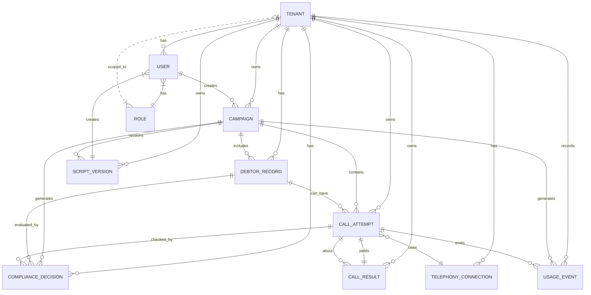

# Domain Model: MVP Lab

Цель документа — зафиксировать базовую предметную модель MVP Lab AI-коллектора с tenant isolation и пригодную для дальнейшей реализации через Prisma/ORM.

## Сущности

### Tenant

- Назначение: изолированная организация/клиент платформы.
- Поля:
  - `id` (UUID, PK)
  - `name` (string, required)
  - `status` (enum: `active`, `suspended`, `blocked`)
  - `createdAt` (timestamp)
  - `updatedAt` (timestamp)
- Связи:
  - 1:N `User`
  - 1:N `Campaign`
  - 1:N `DebtorRecord`
  - 1:N `ScriptVersion`
  - 1:N `TelephonyConnection`
  - 1:N `UsageEvent`

### User

- Назначение: пользователь, выполняющий действия в системе.
- Поля:
  - `id` (UUID, PK)
  - `tenantId` (FK -> Tenant, required)
  - `email` (string, required, unique)
  - `name` (string)
  - `isActive` (boolean)
  - `createdAt` (timestamp)
  - `updatedAt` (timestamp)
- Связи:
  - N:1 `Tenant`
  - N:1 `Role` (через роль/назначение)
  - 1:N `Campaign` как `createdBy`
  - 1:N `ScriptVersion` как `createdBy`

### Role

- Назначение: роль пользователя (для MVP — enum-набор прав).
- Поля:
  - `id` (UUID, PK)
  - `tenantId` (FK -> Tenant, required)
  - `name` (string, required)
  - `description` (string)
  - `isSystem` (boolean)
  - `createdAt` (timestamp)
  - `updatedAt` (timestamp)
- Связи:
  - N:1 `Tenant`
  - 1:N `User`

### Campaign

- Назначение: кампания обзвона.
- Поля:
  - `id` (UUID, PK)
  - `tenantId` (FK -> Tenant, required)
  - `name` (string, required)
  - `status` (enum: `draft`, `review`, `ready`, `running`, `auto_paused`, `completed`, `archived`)
  - `timezone` (string, required)
  - `createdByUserId` (FK -> User)
  - `createdAt` (timestamp)
  - `updatedAt` (timestamp)
- Связи:
  - N:1 `Tenant`
  - N:1 `User` (`createdBy`)
  - 1:N `DebtorRecord`
  - 1:N `ScriptVersion`
  - 1:N `CallAttempt`
  - 1:N `ComplianceDecision`
  - 1:N `UsageEvent`

### DebtorRecord

- Назначение: запись должника в рамках кампании.
- Поля:
  - `id` (UUID, PK)
  - `tenantId` (FK -> Tenant, required)
  - `campaignId` (FK -> Campaign, required)
  - `externalId` (string, required)
  - `phone` (string, required)
  - `timezone` (string)
  - `debtAmount` (decimal)
  - `debtStatus` (enum: `active`, `closed`, `disputed`, `bankruptcy`, `contact_forbidden`)
  - `consentStatus` (enum: `pending`, `given`, `revoked`)
  - `createdAt` (timestamp)
  - `updatedAt` (timestamp)
- Уникальность:
  - `(tenantId, campaignId, externalId)` должен быть unique.
- Связи:
  - N:1 `Tenant`
  - N:1 `Campaign`
  - 1:N `CallAttempt`
  - 1:N `ComplianceDecision`

### ScriptVersion

- Назначение: версия сценария для кампании/tenanta.
- Поля:
  - `id` (UUID, PK)
  - `tenantId` (FK -> Tenant, required)
  - `campaignId` (FK -> Campaign)
  - `version` (int/string, required)
  - `status` (enum: `draft`, `active`, `archived`)
  - `content` (text/json)
  - `createdByUserId` (FK -> User)
  - `createdAt` (timestamp)
- Уникальность:
  - `(campaignId, version)` для конкретной кампании.
- Связи:
  - N:1 `Tenant`
  - N:1 `Campaign`
  - N:1 `User` (`createdBy`)

### ComplianceDecision

- Назначение: факт и объяснение решения compliance для конкретного контакта.
- Поля:
  - `id` (UUID, PK)
  - `tenantId` (FK -> Tenant, required)
  - `campaignId` (FK -> Campaign)
  - `debtorRecordId` (FK -> DebtorRecord)
  - `callAttemptId` (FK -> CallAttempt, optional until end of pipeline)
  - `decision` (enum: `allow`, `block`)
  - `reasonCode` (string)
  - `reasonText` (string)
  - `ruleVersion` (string)
  - `checkedAt` (timestamp)
- Связи:
  - N:1 `Tenant`
  - N:1 `Campaign`
  - N:1 `DebtorRecord`
  - N:1 `CallAttempt`

### TelephonyConnection

- Назначение: конфигурация подключения к провайдеру/связи.
- Поля:
  - `id` (UUID, PK)
  - `tenantId` (FK -> Tenant, required)
  - `provider` (string, required)
  - `mode` (enum: `sandbox`, `production`)
  - `status` (enum: `active`, `disabled`, `invalid`)
  - `displayName` (string)
  - `createdAt` (timestamp)
  - `updatedAt` (timestamp)
- Связи:
  - N:1 `Tenant`
  - 1:N `CallAttempt`
- Security note: секреты не храним в модели (референс в secret store/переменных окружения).

### CallAttempt

- Назначение: попытка совершить телефонный контакт.
- Поля:
  - `id` (UUID, PK)
  - `tenantId` (FK -> Tenant, required)
  - `campaignId` (FK -> Campaign, required)
  - `debtorRecordId` (FK -> DebtorRecord, required)
  - `telephonyConnectionId` (FK -> TelephonyConnection)
  - `status` (enum: `initiated`, `queued`, `ringing`, `answered`, `failed`, `completed`, `no_answer`, `blocked`)
  - `providerCallId` (string)
  - `startedAt` (timestamp)
  - `endedAt` (timestamp)
  - `createdAt` (timestamp)
- Связи:
  - N:1 `Tenant`
  - N:1 `Campaign`
  - N:1 `DebtorRecord`
  - N:1 `TelephonyConnection`
  - 1:1 `CallResult`
  - 1:N `ComplianceDecision`
  - 1:N `UsageEvent`

### CallResult

- Назначение: итог звонка (квалификация результата).
- Поля:
  - `id` (UUID, PK)
  - `tenantId` (FK -> Tenant, required)
  - `callAttemptId` (FK -> CallAttempt, required, unique)
  - `outcome` (enum: `not_called`, `no_answer`, `callback_requested`, `wrong_number`, `ptp_created`, `handoff`, `dispute`, `blocked`, `error`)
  - `ptpAmount` (decimal)
  - `ptpDate` (timestamp)
  - `reason` (string)
  - `transcriptUrl` (string)
  - `recordingUrl` (string)
  - `createdAt` (timestamp)
- Связи:
  - N:1 `Tenant`
  - 1:1 `CallAttempt`

### UsageEvent

- Назначение: событие учёта потребления/активности для биллинга и отчётов.
- Поля:
  - `id` (UUID, PK)
  - `tenantId` (FK -> Tenant, required)
  - `campaignId` (FK -> Campaign, required)
  - `eventType` (enum: `call_started`, `call_completed`, `call_failed`, `handoff`, `transcript_generated`)
  - `quantity` (decimal)
  - `unit` (string)
  - `sourceId` (string)
  - `sourceType` (string)
  - `occurredAt` (timestamp)
  - `createdAt` (timestamp)
- Уникальность:
  - `sourceId` должен поддерживать идемпотентность по внешнему источнику при инвокациях.
- Связи:
  - N:1 `Tenant`
  - N:1 `Campaign`
  - 1:1/0:1 `CallAttempt`

## Базовые связи (обновлённый контур)

- Tenant → Users, Campaigns, DebtorRecords, ScriptVersions, TelephonyConnections, UsageEvents.
- Campaign → DebtorRecords, CallAttempts, ComplianceDecisions, ScriptVersions, UsageEvents.
- DebtorRecord → CallAttempts, ComplianceDecisions.
- CallAttempt → CallResult, ComplianceDecisions, UsageEvents.
- CallResult → CallAttempt (1:1)

## ERD (Mermaid)

